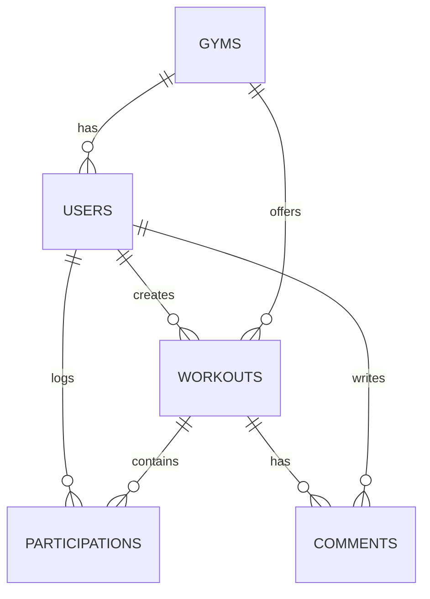

# FitBuddy
 An application to prevent gym-goers from falling into repetitive workout routines by enabling members to share and participate in workouts within their affiliate gyms.

## Problem Definition
Many gym-goers struggle with workout monotony, leading to loss of motivation and plateaued progress. Individuals often repeat the same exercises daily without variation, which reduces workout effectiveness and engagement.

FitBuddy aims to solve this problem by creating a platform where gym and CrossFit members can share workouts within their affiliate gyms. Gym owners can create affiliate gyms where members register, post workouts, and participate in workouts created by others. This encourages variety, motivation, and social interaction in fitness routines.

## Priorities

### Must have
- A gym owner must be able to create an affiliate gym.

- A user must be able to register and join an affiliate gym.

- A user must be able to create and share workouts.

- A user must be able to view workouts posted by other members.

- A user must be able to participate in workouts.

### Should have

- Users should be able to like and comment on workouts.

- Users should be able to log their results when participating in workouts.

- A leaderboard system should be available to rank participants based on their logged results.

- Users should be able to filter workouts based on available equipment.

### Could have
- Users could have a personal dashboard displaying their workout history.

- Workouts could include video demonstrations for exercises.

- A workout rating system could be implemented.

### Will not have
- Direct messaging between users.

- Live workout streaming.

## Domain Model Diagram

