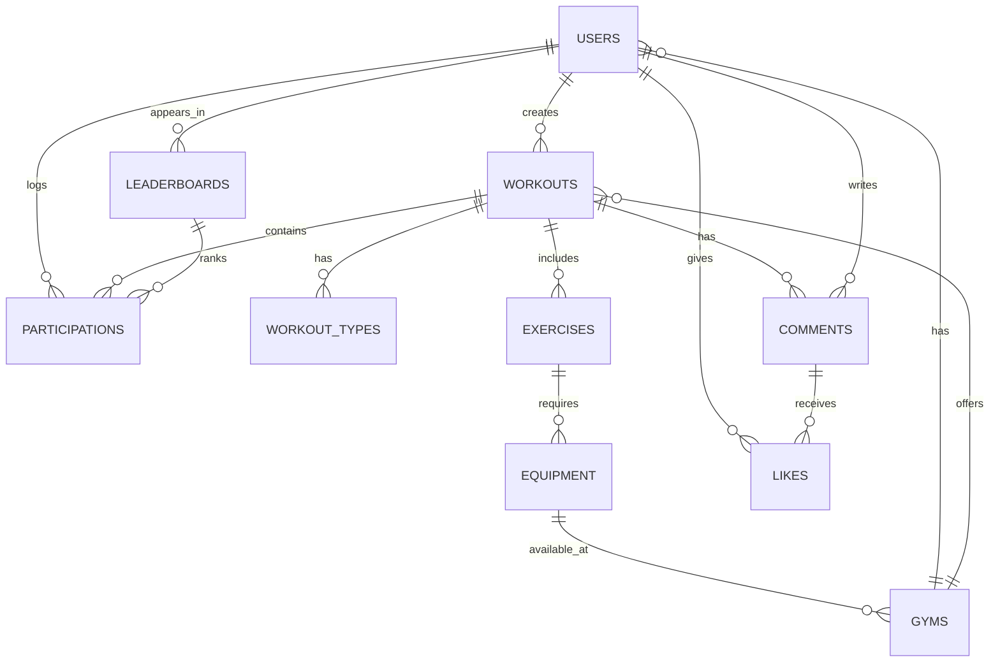
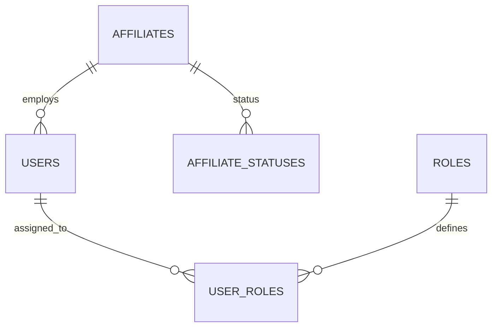

# FitBuddy
 An application to prevent gym-goers from falling into repetitive workout routines by enabling members to share and participate in workouts within their affiliate gyms.

## Problem Definition
Many gym-goers struggle with workout monotony, leading to loss of motivation and plateaued progress. Individuals often repeat the same exercises daily without variation, which reduces workout effectiveness and engagement.

FitBuddy aims to solve this problem by creating a platform where gym and CrossFit members can share workouts within their affiliate gyms. Gym owners can create affiliate gyms where members register, post workouts, and participate in workouts created by others. This encourages variety, motivation, and social interaction in fitness routines.

## Priorities

### Must have
- A gym owner must be able to create an affiliate gym.

- A user must be able to register and join an affiliate gym.

- A user must be able to create and share workouts.

- A user must be able to view workouts posted by other members.

- A user must be able to participate in workouts.

### Should have

- Users should be able to like and comment on workouts.

- Users should be able to log their results when participating in workouts.

- A leaderboard system should be available to rank participants based on their logged results.

- Users should be able to filter workouts based on available equipment.

### Could have
- Users could have a personal dashboard displaying their workout history.

- Workouts could include video demonstrations for exercises.

- A workout rating system could be implemented.

### Will not have
- Direct messaging between users.

- Live workout streaming.

## Domain Model Diagram
## Application

### USERS:
Represents the individuals using the FitBuddy system, such as gym members or administrators. Each user has a unique role and credentials to access the platform.

### AFFILIATES: 
Represents gym affiliates registered within the FitBuddy platform. Each affiliate manages its own set of workouts, equipment, and users.

### WORKOUTS:
Represents specific workout sessions created by users or affiliates. Each workout belongs to a workout type and may include multiple exercises.

### WORKOUT_TYPES:
Represents the type or category of a workout, such as "For Time," "AMRAP," or "Max Weight." Determines how scores are recorded and evaluated.

### EXERCISES:
Represents individual exercises that are part of a workout. Each exercise is associated with specific equipment and instructions.

### PARTICIPATIONS:
Tracks users' participation in workouts, including their results and the date/time of their involvement.

### LEADERBOARDS:
Represents rankings for a specific workout based on user scores. Tracks score types, values, and positions for users.

### COMMENTS:
Represents user-generated comments on workouts, enabling interaction and feedback within the community.

### LIKES:
Tracks "likes" given by users to workouts, fostering engagement and popularity metrics.

### EQUIPMENT:
Represents gym equipment available at affiliates, such as barbells, treadmills, or kettlebells. Equipment is linked to specific workouts and exercises.

### WORKOUT_EQUIPMENT:
Links workouts to the equipment required for their exercises, ensuring users are aware of what they need to participate.

## Affiliate Management

### AFFILIATES:
Represents the affiliate gyms.  Includes essential information like name, database details, email, phone number, and status.

### AFFILIATE_STATUSES:
Represents the statuses of affiliates (e.g., Active, Inactive, Pending).

### USERS:
Represents the users tied to specific affiliates.  Includes personal details, email, password hash, and role information

### ROLES:
Defines the roles (e.g., Admin, Manager, Member)

### USER_ROLES:
Links users to roles, supporting a many-to-many relationship between users and roles.

