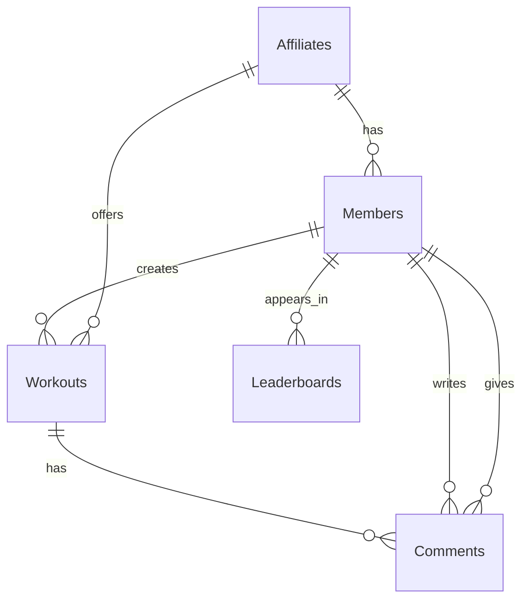
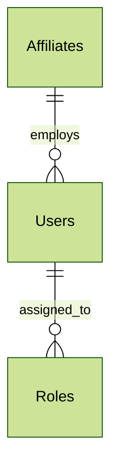

# FitBuddy
 An application to prevent gym-goers from falling into repetitive workout routines by enabling members to share and participate in workouts within their affiliate gyms.

## Problem Definition
Many gym-goers struggle with workout monotony, leading to loss of motivation and plateaued progress. Individuals often repeat the same exercises daily without variation, which reduces workout effectiveness and engagement.

FitBuddy aims to solve this problem by creating a platform where gym and CrossFit members can share workouts within their affiliate gyms. Gym owners can create affiliate gyms where members register, post workouts, and participate in workouts created by others. This encourages variety, motivation, and social interaction in fitness routines.

## Priorities

### Must have
- A Admin must be able to create an affiliate gym.

- A member must be able to register and join an affiliate gym.

- A member must be able to create and share workouts.

- A member must be able to view workouts posted by other members.

- A member must be able to participate in workouts.

### Should have

- Members should be able to comment on workouts.

- Members should be able to log their results when participating in workouts.

- A leaderboard system should be available to rank participants based on their logged results.

### Could have
- Members could have a personal dashboard displaying their workout history.

- Workouts could include video demonstrations for exercises.

- A workout rating system could be implemented.

### Will not have
- Direct messaging between members.

- Live workout streaming.

# Domain Model diagram
## Application

### Members:
Represents the gym members using the FitBuddy system. Each user has a username and password to access the platform.

### Affiliates: 
Represents gym affiliates registered within the FitBuddy platform. Each affiliate manages its own set of workouts, equipment, and members.

### Workouts:
Represents specific workout sessions created by members. Each workout belongs to a workout type and results.

### Leaderboards:
Represents rankings for a specific workout based on member results. Tracks score types, values, and positions for members.

### Comments:
Represents user-generated comments on workouts, enabling interaction and feedback within the community.

## Affiliate Management

### Affiliates:
Represents the affiliate gyms.  Includes essential information like name, database details, email, phone number, and status.

### Users:
Represents the Affiliate owners tied to specific affiliates.  Includes personal details, email, password hash, and role information

### Roles:
Defines the roles (e.g., Admin, Coach)

