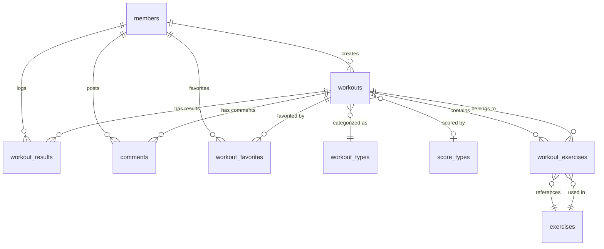

# Database Design

## 🗄️ PostgreSQL Database Schema

FitBuddy uses PostgreSQL as its primary database, designed specifically for CrossFit workout management with a simplified, focused schema.

## 📊 Schema Overview

The database has been simplified to focus exclusively on CrossFit functionality, removing complex categorization and focusing on essential features.

### Core Tables (9 tables total)

```sql
-- Core Entity Tables
members                    # User accounts and authentication
workouts                   # Workout definitions
workout_types              # CrossFit workout types (EMOM, AMRAP, etc.)
exercises                  # Exercise library
score_types               # Scoring methods (Time, Rounds, etc.)

-- Relationship Tables
workout_exercises         # Junction table for workout composition
workout_results          # Performance tracking
comments                 # Social features
workout_favorites        # User bookmarks
```

## 🏗️ Detailed Table Structures

### 1. Members Table

**Purpose**: User accounts and authentication

```sql
CREATE TABLE members (
    id SERIAL PRIMARY KEY,
    username VARCHAR(255) NOT NULL UNIQUE,
    email VARCHAR(255) NOT NULL UNIQUE,
    password_hash VARCHAR(255) NOT NULL,
    created_date TIMESTAMP DEFAULT CURRENT_TIMESTAMP,
    modified_date TIMESTAMP
);
```

**Key Features**:
- Unique username and email constraints
- Secure password hashing storage
- Audit trail with created/modified dates

### 2. Workout Types Table

**Purpose**: CrossFit workout categorization

```sql
CREATE TABLE workout_types (
    id SERIAL PRIMARY KEY,
    name VARCHAR(255) NOT NULL UNIQUE
);

-- Reference data
INSERT INTO workout_types (id, name) VALUES
    (1, 'EMOM'),      -- Every Minute on the Minute
    (2, 'AMRAP'),     -- As Many Rounds As Possible
    (3, 'For Time'),  -- Complete as fast as possible
    (4, 'Tabata'),    -- High-intensity intervals
    (5, 'Ladder');    -- Increasing/decreasing reps
```

**Key Features**:
- Fixed set of CrossFit workout types
- Simple enumeration for classification

### 3. Score Types Table

**Purpose**: Workout scoring methods

```sql
CREATE TABLE score_types (
    id SERIAL PRIMARY KEY,
    name VARCHAR(100) NOT NULL UNIQUE,
    description TEXT,
    created_date TIMESTAMP DEFAULT CURRENT_TIMESTAMP
);

-- Reference data
INSERT INTO score_types (name, description) VALUES
    ('Time', 'Complete workout as fast as possible'),
    ('Rounds', 'Complete as many rounds as possible'),
    ('Weight', 'Lift maximum weight'),
    ('Reps', 'Complete maximum repetitions'),
    ('Distance', 'Travel maximum distance'),
    ('Calories', 'Burn maximum calories');
```

### 4. Workouts Table

**Purpose**: Workout definitions and metadata

```sql
CREATE TABLE workouts (
    id SERIAL PRIMARY KEY,
    name VARCHAR(255) NOT NULL UNIQUE,
    description TEXT,
    workout_type_id INT NOT NULL,
    created_by_id INT NOT NULL,
    created_date TIMESTAMP DEFAULT CURRENT_TIMESTAMP,
    modified_date TIMESTAMP,
    
    -- CrossFit-specific enhancements
    score_type_id INT REFERENCES score_types(id),
    difficulty_level INT CHECK (difficulty_level BETWEEN 1 AND 5),
    estimated_duration_minutes INT,
    
    FOREIGN KEY (workout_type_id) REFERENCES workout_types(id),
    FOREIGN KEY (created_by_id) REFERENCES members(id)
);
```

**Key Features**:
- Unique workout names
- Reference to workout type and creator
- Optional scoring method and difficulty
- Estimated duration for planning

### 5. Exercises Table

**Purpose**: CrossFit exercise library

```sql
CREATE TABLE exercises (
    id SERIAL PRIMARY KEY,
    name VARCHAR(200) NOT NULL UNIQUE,
    description TEXT,
    instructions TEXT,
    created_date TIMESTAMP DEFAULT CURRENT_TIMESTAMP
);
```

**Essential CrossFit Exercises**:
- Burpees, Thrusters, Pull-ups, Push-ups
- Box Jumps, Kettlebell Swings, Wall Balls
- Double Unders, Mountain Climbers, Air Squats
- Olympic lifts: Clean and Jerk, Snatch, Deadlifts
- Gymnastic movements: Muscle-ups, Handstand Push-ups
- Core exercises: Sit-ups, Russian Twists, Plank

### 6. Workout Exercises Table

**Purpose**: Junction table defining workout composition

```sql
CREATE TABLE workout_exercises (
    id SERIAL PRIMARY KEY,
    workout_id INT NOT NULL,
    exercise_id INT NOT NULL,
    order_in_workout INT NOT NULL,
    sets INT,
    reps INT,
    time_seconds INT,
    rest_seconds INT,
    weight_description VARCHAR(100), -- e.g., "bodyweight", "50kg", "heavy"
    notes TEXT,
    created_date TIMESTAMP DEFAULT CURRENT_TIMESTAMP,
    
    FOREIGN KEY (workout_id) REFERENCES workouts(id) ON DELETE CASCADE,
    FOREIGN KEY (exercise_id) REFERENCES exercises(id)
);
```

**Key Features**:
- Flexible parameter storage (sets, reps, time, weight)
- Ordered exercises within workouts
- Descriptive weight specifications
- Notes for specific instructions

### 7. Workout Results Table

**Purpose**: Performance tracking and personal records

```sql
CREATE TABLE workout_results (
    id SERIAL PRIMARY KEY,
    workout_id INT NOT NULL,
    created_by_id INT NOT NULL,
    result TEXT, -- Original result field
    created_date TIMESTAMP DEFAULT CURRENT_TIMESTAMP,
    modified_date TIMESTAMP,
    
    -- Enhanced performance metrics
    completion_time_seconds INT,
    difficulty_rating INT CHECK (difficulty_rating BETWEEN 1 AND 5),
    workout_rating INT CHECK (workout_rating BETWEEN 1 AND 5),
    rpe_rating INT CHECK (rpe_rating BETWEEN 1 AND 10), -- Rate of Perceived Exertion
    notes TEXT,
    is_personal_record BOOLEAN DEFAULT FALSE,
    
    FOREIGN KEY (workout_id) REFERENCES workouts(id),
    FOREIGN KEY (created_by_id) REFERENCES members(id)
);
```

**Key Features**:
- Multiple result tracking methods
- Personal record flagging
- Subjective rating scales
- Performance analytics support

### 8. Comments Table

**Purpose**: Social interaction and workout discussions

```sql
CREATE TABLE comments (
    id SERIAL PRIMARY KEY,
    workout_id INT NOT NULL,
    created_by_id INT NOT NULL,
    description TEXT, -- Renamed from 'comment'
    created_date TIMESTAMP DEFAULT CURRENT_TIMESTAMP,
    modified_date TIMESTAMP,
    
    FOREIGN KEY (workout_id) REFERENCES workouts(id),
    FOREIGN KEY (created_by_id) REFERENCES members(id)
);
```

**Key Features**:
- Workout-specific discussions
- User-generated content
- Audit trail for modifications

### 9. Workout Favorites Table

**Purpose**: User bookmarking and personal collections

```sql
CREATE TABLE workout_favorites (
    id SERIAL PRIMARY KEY,
    workout_id INT NOT NULL,
    member_id INT NOT NULL,
    created_date TIMESTAMP DEFAULT CURRENT_TIMESTAMP,
    
    FOREIGN KEY (workout_id) REFERENCES workouts(id) ON DELETE CASCADE,
    FOREIGN KEY (member_id) REFERENCES members(id) ON DELETE CASCADE,
    UNIQUE(workout_id, member_id)
);
```

**Key Features**:
- Unique constraint prevents duplicate favorites
- Cascade deletion for data integrity
- Simple bookmark functionality

## 🔗 Entity Relationships

### Primary Relationships



### Relationship Details

**One-to-Many Relationships**:
- Member → Workouts (created_by)
- Member → Workout Results (performance tracking)
- Member → Comments (social interaction)
- Workout → Workout Exercises (composition)
- Workout → Results (performance history)
- Exercise → Workout Exercises (usage tracking)

**Many-to-Many Relationships**:
- Members ↔ Workouts (via workout_favorites)
- Workouts ↔ Exercises (via workout_exercises)

## 📈 Database Performance

### Indexing Strategy

**Primary Indexes**:
```sql
-- Performance-critical indexes
CREATE INDEX idx_workouts_created_by ON workouts(created_by_id);
CREATE INDEX idx_workouts_workout_type ON workouts(workout_type_id);
CREATE INDEX idx_workouts_score_type ON workouts(score_type_id);
CREATE INDEX idx_workouts_difficulty ON workouts(difficulty_level);
CREATE INDEX idx_workouts_duration ON workouts(estimated_duration_minutes);

-- Junction table indexes
CREATE INDEX idx_workout_exercises_workout ON workout_exercises(workout_id);
CREATE INDEX idx_workout_exercises_exercise ON workout_exercises(exercise_id);
CREATE INDEX idx_workout_exercises_order ON workout_exercises(workout_id, order_in_workout);

-- User activity indexes
CREATE INDEX idx_workout_favorites_member ON workout_favorites(member_id);
CREATE INDEX idx_workout_favorites_workout ON workout_favorites(workout_id);
CREATE INDEX idx_workout_results_member ON workout_results(created_by_id);
CREATE INDEX idx_workout_results_workout ON workout_results(workout_id);
CREATE INDEX idx_workout_results_completion_time ON workout_results(completion_time_seconds);
CREATE INDEX idx_workout_results_is_pr ON workout_results(is_personal_record);
```

### Query Optimization

**Common Query Patterns**:
```sql
-- Efficient workout listing with related data
SELECT w.*, wt.name as workout_type_name, m.username as created_by_name,
       COUNT(DISTINCT wr.id) as result_count,
       COUNT(DISTINCT wf.id) as favorite_count
FROM workouts w
JOIN workout_types wt ON w.workout_type_id = wt.id
JOIN members m ON w.created_by_id = m.id
LEFT JOIN workout_results wr ON w.id = wr.workout_id
LEFT JOIN workout_favorites wf ON w.id = wf.workout_id
GROUP BY w.id, wt.name, m.username
ORDER BY w.created_date DESC;

-- Personal records query
SELECT wr.*, w.name as workout_name
FROM workout_results wr
JOIN workouts w ON wr.workout_id = w.id
WHERE wr.created_by_id = ? AND wr.is_personal_record = TRUE
ORDER BY wr.created_date DESC;
```

## 📊 Data Analytics Support

### Workout Statistics View

```sql
CREATE VIEW workout_stats AS
SELECT 
    w.id,
    w.name,
    w.workout_type_id,
    w.score_type_id,
    w.difficulty_level,
    w.estimated_duration_minutes,
    COUNT(DISTINCT wr.id) as total_completions,
    COUNT(DISTINCT wf.id) as total_favorites,
    COUNT(DISTINCT c.id) as total_comments,
    AVG(wr.difficulty_rating) as avg_difficulty_rating,
    AVG(wr.workout_rating) as avg_workout_rating,
    MIN(wr.completion_time_seconds) as best_time,
    AVG(wr.completion_time_seconds) as avg_time
FROM workouts w
LEFT JOIN workout_results wr ON w.id = wr.workout_id
LEFT JOIN workout_favorites wf ON w.id = wf.workout_id
LEFT JOIN comments c ON w.id = c.workout_id
GROUP BY w.id, w.name, w.workout_type_id, w.score_type_id, w.difficulty_level, w.estimated_duration_minutes;
```

### Performance Metrics Queries

```sql
-- Member performance dashboard
SELECT 
    m.username,
    COUNT(DISTINCT wr.workout_id) as unique_workouts_completed,
    COUNT(wr.id) as total_sessions,
    COUNT(CASE WHEN wr.is_personal_record THEN 1 END) as personal_records,
    AVG(wr.workout_rating) as avg_workout_rating,
    AVG(wr.difficulty_rating) as avg_difficulty_rating
FROM members m
LEFT JOIN workout_results wr ON m.id = wr.created_by_id
WHERE m.id = ?
GROUP BY m.id, m.username;

-- Popular workouts
SELECT w.name, COUNT(wr.id) as completion_count
FROM workouts w
JOIN workout_results wr ON w.id = wr.workout_id
GROUP BY w.id, w.name
ORDER BY completion_count DESC
LIMIT 10;
```

## 🔒 Data Integrity

### Constraints and Validations

**Check Constraints**:
```sql
-- Ensure valid rating ranges
ALTER TABLE workouts ADD CONSTRAINT chk_difficulty_level 
    CHECK (difficulty_level BETWEEN 1 AND 5);

ALTER TABLE workout_results ADD CONSTRAINT chk_difficulty_rating 
    CHECK (difficulty_rating BETWEEN 1 AND 5);

ALTER TABLE workout_results ADD CONSTRAINT chk_workout_rating 
    CHECK (workout_rating BETWEEN 1 AND 5);

ALTER TABLE workout_results ADD CONSTRAINT chk_rpe_rating 
    CHECK (rpe_rating BETWEEN 1 AND 10);
```

**Foreign Key Constraints**:
```sql
-- Cascade deletes for data consistency
ALTER TABLE workout_exercises ADD CONSTRAINT fk_workout_exercises_workout
    FOREIGN KEY (workout_id) REFERENCES workouts(id) ON DELETE CASCADE;

ALTER TABLE workout_favorites ADD CONSTRAINT fk_workout_favorites_workout
    FOREIGN KEY (workout_id) REFERENCES workouts(id) ON DELETE CASCADE;

ALTER TABLE workout_favorites ADD CONSTRAINT fk_workout_favorites_member
    FOREIGN KEY (member_id) REFERENCES members(id) ON DELETE CASCADE;
```

### Data Validation Rules

**Business Rules**:
- Workout names must be unique
- Email addresses must be unique per member
- Workout exercises must have valid order sequence
- Difficulty ratings must be within 1-5 range
- RPE ratings must be within 1-10 range

## 🚀 Migration Strategy

### Database Migrations

**Migration Files**:
```sql
-- V1.0__initial_schema_setup.sql
-- Creates core tables: members, workouts, workout_types, comments, workout_results

-- V1.1__initial_ref_data.sql
-- Populates workout_types with CrossFit categories

-- V1.2__simplified_crossfit_schema.sql
-- Adds all enhanced tables and CrossFit-specific features
```

**Migration Best Practices**:
- Always backup before migrations
- Test migrations on development environment
- Use transactions for rollback capability
- Document all schema changes

## 📊 Monitoring and Maintenance

### Database Health Monitoring

**Performance Metrics**:
```sql
-- Query performance monitoring
SELECT query, mean_time, calls, total_time
FROM pg_stat_statements
WHERE query LIKE '%workouts%'
ORDER BY mean_time DESC;

-- Index usage analysis
SELECT indexname, idx_scan, idx_tup_read, idx_tup_fetch
FROM pg_stat_user_indexes
WHERE schemaname = 'public'
ORDER BY idx_scan DESC;
```

### Maintenance Tasks

**Regular Maintenance**:
```sql
-- Update table statistics
ANALYZE workouts;
ANALYZE workout_results;
ANALYZE workout_exercises;

-- Vacuum for performance
VACUUM ANALYZE;

-- Reindex if needed
REINDEX TABLE workouts;
```

---

*This database design supports the simplified CrossFit-focused FitBuddy application with optimal performance and data integrity.*