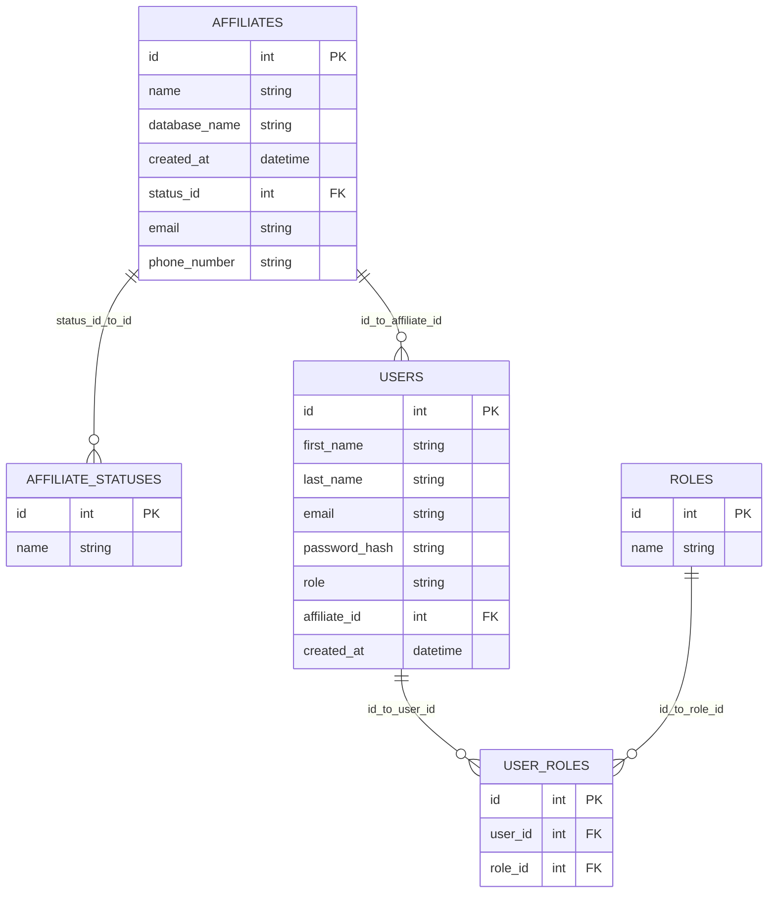

# ERDs:
## Full

```mermaid

erDiagram
    AFFILIATES {
        id int PK
        name string
        database_name string
        created_at datetime
        status_id int FK
        email string
        phone_number string
    }

    AFFILIATE_STATUSES {
        id int PK
        name string
    }

    USERS {
        id int PK
        first_name string
        last_name string
        email string 
        password_hash string
        role string
        affiliate_id int FK
        created_at datetime
    }

    ROLES {
        id int PK
        name string
    }

    USER_ROLES {
        id int PK
        user_id int FK
        role_id int FK
    }

AFFILIATES ||--o{ USERS : id_to_affiliate_id
AFFILIATES ||--o{ AFFILIATE_STATUSES : status_id_to_id
USERS ||--o{ USER_ROLES : id_to_user_id
ROLES ||--o{ USER_ROLES : id_to_role_id

```