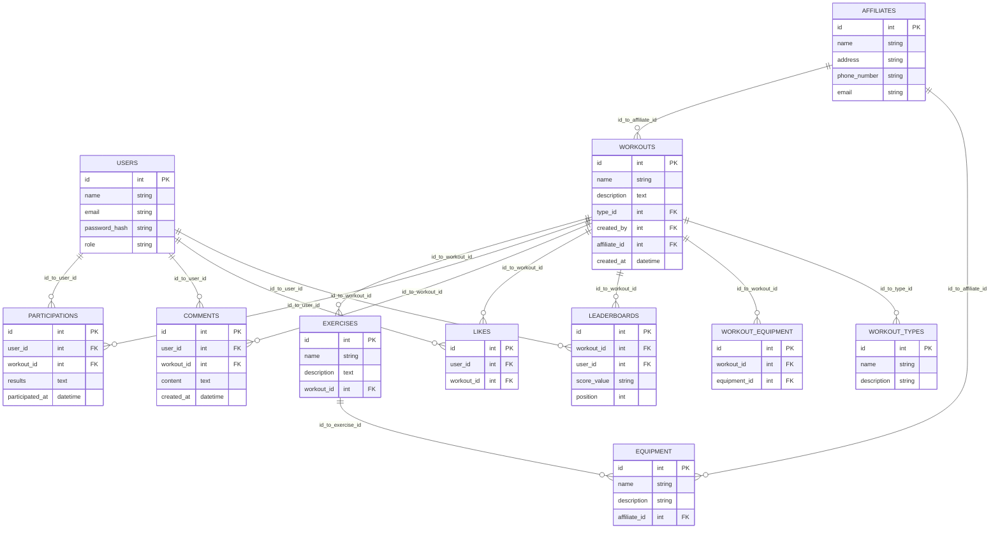

# ERDs:
## Full

```mermaid

erDiagram
    USERS {
        id int PK
        name string
        email string 
        password_hash string
        role string
    }

    AFFILIATES {
        id int PK
        name string
        address string
        phone_number string
        email string
    }

    WORKOUTS {
        id int PK
        name string
        description text
        type_id int FK
        created_by int FK
        affiliate_id int FK
        created_at datetime
    }

    WORKOUT_TYPES {
        id int PK
        name string
        description string
    }

    EXERCISES {
        id int PK
        name string
        description text
        workout_id int FK
    }

    PARTICIPATIONS {
        id int PK
        user_id int FK
        workout_id int FK
        results text
        participated_at datetime
    }  

    LEADERBOARDS {
        id int PK
        workout_id int FK
        user_id int FK
        score_value string
        position int
    }

    COMMENTS {
        id int PK
        user_id int FK
        workout_id int FK
        content text
        created_at datetime
    }
    
    LIKES {
        id int PK
        user_id int FK
        workout_id int FK
    }
    
    EQUIPMENT {
        id int PK
        name string
        description string
        affiliate_id int FK
    }
    
    WORKOUT_EQUIPMENT {
        id int PK
        workout_id int FK
        equipment_id int FK
    }

    USERS ||--o{ PARTICIPATIONS : id_to_user_id
    USERS ||--o{ COMMENTS : id_to_user_id
    USERS ||--o{ LIKES : id_to_user_id
    USERS ||--o{ LEADERBOARDS : id_to_user_id
    WORKOUTS ||--o{ EXERCISES : id_to_workout_id
    WORKOUTS ||--o{ PARTICIPATIONS : id_to_workout_id
    WORKOUTS ||--o{ COMMENTS : id_to_workout_id
    WORKOUTS ||--o{ LIKES : id_to_workout_id
    WORKOUTS ||--o{ LEADERBOARDS : id_to_workout_id
    WORKOUTS ||--o{ WORKOUT_EQUIPMENT : id_to_workout_id
    WORKOUTS ||--o{ WORKOUT_TYPES : id_to_type_id
    EXERCISES ||--o{ EQUIPMENT : id_to_exercise_id
    AFFILIATES ||--o{ WORKOUTS : id_to_affiliate_id
    AFFILIATES ||--o{ EQUIPMENT : id_to_affiliate_id

```