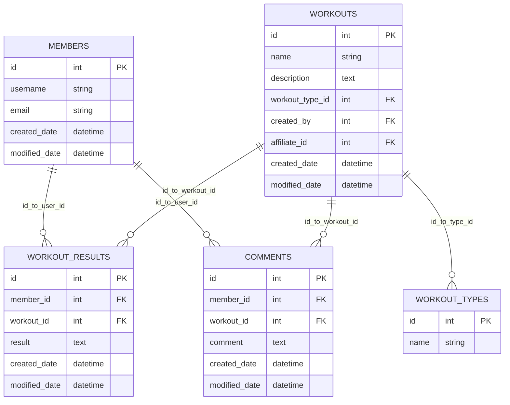

# ERDs:
## Full

```mermaid

erDiagram
    MEMBERS {
        id int PK
        username string
        email string
        created_date datetime
        modified_date datetime
    }

    WORKOUTS {
        id int PK
        name string
        description text
        workout_type_id int FK
        created_by int FK
        affiliate_id int FK
        created_date datetime
        modified_date datetime
    }

    WORKOUT_TYPES {
        id int PK
        name string
    }
    
    WORKOUT_RESULTS {
        id int PK
        member_id int FK
        workout_id int FK
        result text
        created_date datetime
        modified_date datetime
    }

    COMMENTS {
        id int PK
        member_id int FK
        workout_id int FK
        comment text
        created_date datetime
        modified_date datetime
    }
    
    MEMBERS ||--o{ WORKOUT_RESULTS : id_to_user_id
    MEMBERS ||--o{ COMMENTS : id_to_user_id
    WORKOUTS ||--o{ WORKOUT_RESULTS : id_to_workout_id
    WORKOUTS ||--o{ COMMENTS : id_to_workout_id
    WORKOUTS ||--o{ WORKOUT_TYPES : id_to_type_id
```